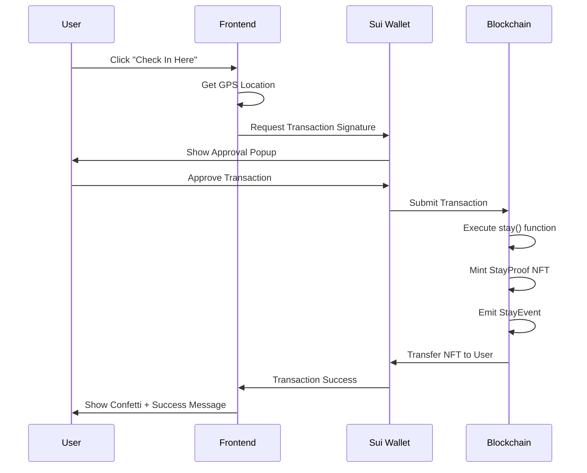
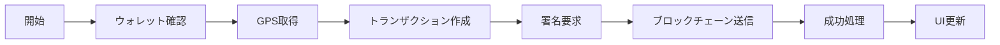
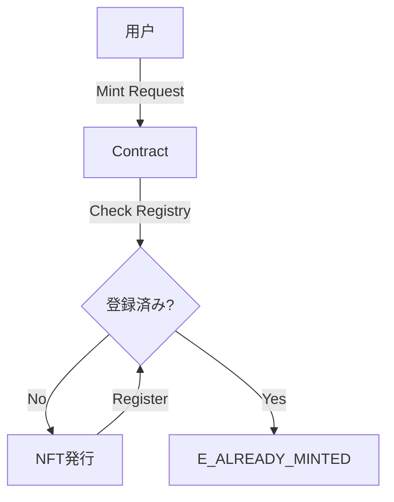

# 🛠️ Sui Passport アプリ - 開発者向けドキュメント

## 📋 目次

1. [プロジェクト概要](#1-プロジェクト概要)
2. [技術スタック](#2-技術スタック)
3. [アーキテクチャ](#3-アーキテクチャ)
4. [セットアップ](#4-セットアップ)
5. [コンポーネント詳細](#5-コンポーネント詳細)
6. [スマートコントラクト](#6-スマートコントラクト)
7. [状態管理とデータフロー](#7-状態管理とデータフロー)
8. [カスタマイズガイド](#8-カスタマイズガイド)
9. [デプロイメント](#9-デプロイメント)

---

## 1. プロジェクト概要

**Sui Passport**は、Suiブロックチェーン上で動作する位置情報ベースのdAppです。

### 主要機能

| 機能 | 説明 | 技術 |
|------|------|------|
| **チェックイン** | GPS位置情報をブロックチェーンに記録 | Geolocation API + Move |
| **バッジシステム** | チェックイン回数を追跡・表示 | React State + NFT |
| **レジデントカード** | デジタル住民カードのミント | NFT + 画像アップロード |
| **3D UI** | インタラクティブなカードアニメーション | Framer Motion |

### プロジェクト構成

```
sui app/
├── frontend/              # React + Vite フロントエンド
│   ├── src/
│   │   ├── App.tsx       # メインアプリケーション
│   │   ├── StayFeature.tsx    # チェックイン機能
│   │   ├── components/
│   │   │   └── ResidentCard.tsx  # レジデントカード
│   │   ├── main.tsx      # エントリーポイント
│   │   └── index.css     # グローバルスタイル
│   └── package.json
└── backend/
    └── stay_mock/
        └── sources/
            └── resident_nft.move  # Moveスマートコントラクト
```

---

## 2. 技術スタック

### フロントエンド

| カテゴリ | 技術 | バージョン | 用途 |
|----------|------|-----------|------|
| **フレームワーク** | React | ^18.3.1 | UI構築 |
| **ビルドツール** | Vite | ^5.4.10 | 開発サーバー・ビルド |
| **言語** | TypeScript | ^5.6.3 | 型安全性 |
| **スタイリング** | Tailwind CSS | ^3.4.0 | ユーティリティCSS |
| **アニメーション** | Framer Motion | ^12.23.25 | 3Dアニメーション |
| **地図** | React Leaflet | ^4.2.1 | 地図表示 |
| **Sui統合** | @mysten/dapp-kit | ^0.14.0 | ウォレット接続 |
| **Sui SDK** | @mysten/sui | ^1.13.0 | トランザクション |
| **状態管理** | @tanstack/react-query | ^5.0.0 | 非同期状態管理 |
| **通知** | react-hot-toast | ^2.6.0 | トースト通知 |
| **エフェクト** | react-confetti | ^6.4.0 | 紙吹雪アニメーション |

### バックエンド

| カテゴリ | 技術 | 用途 |
|----------|------|------|
| **スマートコントラクト** | Move | ブロックチェーンロジック |
| **ブロックチェーン** | Sui Testnet | デプロイ環境 |

---

## 3. アーキテクチャ

### システムアーキテクチャ図

```mermaid
graph TB
    subgraph "Frontend (React + Vite)"
        A[App.tsx] --> B[StayFeature.tsx]
        A --> C[ResidentCard.tsx]
        B --> D[Geolocation API]
        B --> E[@mysten/dapp-kit]
        C --> E
    end
    
    subgraph "Sui Blockchain"
        E --> F[Sui Wallet]
        F --> G[stay_feature Module]
        G --> H[StayProof NFT]
        G --> I[StayEvent]
    end
    
    subgraph "External Services"
        B --> J[OpenStreetMap API]
        D --> K[Browser GPS]
    end
    
    style A fill:#3b82f6,color:#fff
    style G fill:#10b981,color:#fff
    style H fill:#8b5cf6,color:#fff
```

### データフロー



---

## 4. セットアップ

### 前提条件

- Node.js 18.x 以上
- npm または yarn
- Sui Wallet ブラウザ拡張機能

### インストール手順

#### 1. フロントエンドのセットアップ

```bash
cd "/Users/koki/Desktop/sui app/frontend"

# 依存関係のインストール
npm install

# 開発サーバーの起動
npm run dev
```

#### 2. 環境変数（オプション）

現在は不要ですが、将来的に追加する場合:

```bash
# .env.local
VITE_SUI_NETWORK=testnet
VITE_PACKAGE_ID=0x3bca8a973194ce69f0c3ddc36932a95776da95ec0c3d0356f37ce70eab0fb7c5
```

#### 3. スマートコントラクトのビルド（オプション）

```bash
cd "/Users/koki/Desktop/sui app/backend/stay_mock"

# Moveコントラクトのビルド
sui move build

# テストネットへのデプロイ
sui client publish --gas-budget 100000000
```

---

## 5. コンポーネント詳細

### 5.1 App.tsx

**役割**: アプリケーションのルートコンポーネント

**主要機能**:
- タブナビゲーション（Check-in / My Card）
- ウォレット接続UI
- グローバルレイアウト

**状態管理**:
```typescript
const [activeTab, setActiveTab] = useState<'checkin' | 'card'>('checkin');
```

**重要なコード**:
```typescript
// ウォレットプロバイダーのセットアップ
<SuiClientProvider networks={networkConfig} defaultNetwork="testnet">
  <WalletProvider>
    <App />
  </WalletProvider>
</SuiClientProvider>
```

---

### 5.2 StayFeature.tsx

**役割**: チェックイン機能の実装

#### 主要な状態

| 状態 | 型 | 説明 |
|------|-----|------|
| `status` | `'idle' \| 'locating' \| 'signing' \| 'submitting' \| 'success'` | 処理状態 |
| `tokenCount` | `number` | 獲得バッジ数 |
| `location` | `{ lat: number; lng: number } \| null` | 現在地 |
| `showConfetti` | `boolean` | 紙吹雪表示フラグ |

#### 重要な関数

##### `getPosition()`

GPS位置情報を取得します。

```typescript
const getPosition = (): Promise<GeolocationPosition> => {
  return new Promise((resolve, reject) => {
    if (!navigator.geolocation) {
      reject(new Error('Geolocation is not supported'));
      return;
    }
    navigator.geolocation.getCurrentPosition(
      (pos) => resolve(pos),
      (err) => reject(new Error(`GPS Error: ${err.message}`)),
      { 
        enableHighAccuracy: true, 
        timeout: GPS_TIMEOUT_MS, 
        maximumAge: 0 
      }
    );
  });
};
```

**パラメータ**:
- `enableHighAccuracy`: 高精度GPS使用
- `timeout`: タイムアウト時間（10秒）
- `maximumAge`: キャッシュを使用しない

##### `handleCheckIn()`

チェックイン処理のメインロジック。

**処理フロー**:



**コード解説**:

```typescript
const handleCheckIn = async () => {
  // 1. ウォレット接続確認
  if (!account) {
    toast.error('Please connect your wallet first!');
    return;
  }

  try {
    // 2. GPS取得
    setStatus('locating');
    const position = await getPosition();
    const { latitude, longitude } = position.coords;
    setLocation({ lat: latitude, lng: longitude });

    // 3. トランザクション作成
    setStatus('signing');
    const tx = new Transaction();
    const latInt = Math.floor(latitude * 1000000);  // 小数点6桁を整数化
    const lngInt = Math.floor(longitude * 1000000);

    tx.moveCall({
      target: `${PACKAGE_ID}::${MODULE_NAME}::${FUNCTION_NAME}`,
      arguments: [tx.pure.u64(latInt), tx.pure.u64(lngInt)],
    });

    // 4. トランザクション送信
    setStatus('submitting');
    await signAndExecuteTransaction(
      { transaction: tx },
      {
        onSuccess: (result) => {
          setStatus('success');
          setTokenCount((prev) => prev + 1);
          setShowConfetti(true);
          playSuccessSound();
          toast.success('Check-in Successful!');
        },
        onError: (error) => {
          throw error;
        },
      }
    );
  } catch (error: any) {
    setStatus('idle');
    toast.error(error.message || 'Something went wrong');
  }
};
```

> [!IMPORTANT]
> 緯度・経度は小数点6桁の精度で整数化されます（例: 35.681236 → 35681236）。これはMoveが浮動小数点をサポートしていないためです。

#### 地図コンポーネント

**RecenterMap**: 位置更新時に地図を中心に移動

```typescript
const RecenterMap = ({ lat, lng }: { lat: number; lng: number }) => {
  const map = useMap();
  useEffect(() => {
    map.setView([lat, lng], map.getZoom());
  }, [lat, lng, map]);
  return null;
};
```

**使用方法**:
```typescript
<MapContainer center={[defaultLocation.lat, defaultLocation.lng]} zoom={15}>
  <TileLayer url="https://{s}.tile.openstreetmap.org/{z}/{x}/{y}.png" />
  {location && (
    <>
      <RecenterMap lat={location.lat} lng={location.lng} />
      <Marker position={[location.lat, location.lng]} />
      <Circle center={[location.lat, location.lng]} radius={50} />
    </>
  )}
</MapContainer>
```

---

### 5.3 ResidentCard.tsx

**役割**: デジタル住民カードの表示とミント

#### 主要な状態

```typescript
const [hasNFT, setHasNFT] = useState(false);           // NFT所有フラグ
const [residentImage, setResidentImage] = useState<string | null>(null);  // アップロード画像
```

#### 3Dチルトエフェクト

Framer Motionを使用した3Dアニメーション:

```typescript
// マウス位置を追跡
const x = useMotionValue(0);
const y = useMotionValue(0);

// 回転角度を計算（-10度 〜 +10度）
const rotateX = useSpring(
  useTransform(y, [-100, 100], [10, -10]), 
  { stiffness: 150, damping: 20 }
);
const rotateY = useSpring(
  useTransform(x, [-100, 100], [-10, 10]), 
  { stiffness: 150, damping: 20 }
);

// マウス移動ハンドラ
const handleMouseMove = (event: React.MouseEvent<HTMLDivElement>) => {
  const rect = event.currentTarget.getBoundingClientRect();
  const centerX = rect.left + rect.width / 2;
  const centerY = rect.top + rect.height / 2;
  x.set(event.clientX - centerX);
  y.set(event.clientY - centerY);
};
```

**適用**:
```typescript
<motion.div
  style={{ rotateX, rotateY, transformStyle: "preserve-3d" }}
  onMouseMove={handleMouseMove}
  onMouseLeave={handleMouseLeave}
>
  {/* カードコンテンツ */}
</motion.div>
```

#### 画像アップロード

```typescript
const handleFileChange = (event: React.ChangeEvent<HTMLInputElement>) => {
  const file = event.target.files?.[0];
  if (file) {
    const reader = new FileReader();
    reader.onloadend = () => {
      setResidentImage(reader.result as string);  // Base64エンコード
    };
    reader.readAsDataURL(file);
  }
};
```

#### カードデザイン

**グラデーション背景**:
```css
/* Neon Gradients */
.absolute.top-[-50%].left-[-20%] {
  background: radial-gradient(circle, rgba(37, 99, 235, 0.3) 0%, transparent 70%);
  filter: blur(80px);
}
```

**ホログラフィック効果**:
```css
.bg-gradient-to-tr.from-transparent.via-white\/5.to-transparent {
  opacity: 0;
  transition: opacity 0.5s;
}

.group:hover .bg-gradient-to-tr {
  opacity: 1;
}
```

---

### 6. スマートコントラクト

#### 6.1 コントラクト情報 (Testnet)

| 項目 | 値 |
|------|-----|
| **Package ID** | `0xb055fd8885acb1809540fe22b2ed5a282c8f5be86251954a35f2a8614811058b` |
| **ResidentRegistry ID** | `0x99a8dc2df00b6892f6d097ea3b710447b71b9ad79c578af9bed9fa689d2f03cf` |
| **TokenRegistry ID** | `0x671eaa16a4e4d2a39fb86cbf1a3ac5cc4e70a84b8ff740604a38a36daa0977ae` |

#### 6.2 Registry パターン（重要）

本プロジェクトではSybil攻撃（多重登録）を防ぐため、Registryパターンを採用しています。

**アーキテクチャ図**:


1. **ResidentRegistry**: 住民票NFTの発行状況を管理
2. **TokenRegistry**: ポイント通帳（TokenBalance）の発行状況を管理

`init` 関数で共有オブジェクトとして作成され、全てのミント操作はこのRegistryを参照して重複チェックを行います。

#### データ構造

##### StayProof (NFT)

```move
public struct StayProof has key, store {
    id: UID,      // ユニークID
    lat: u64,     // 緯度（整数化）
    lng: u64,     // 経度（整数化）
}
```

**アビリティ**:
- `key`: グローバルストレージに保存可能
- `store`: 転送・保存可能

##### StayEvent (イベント)

```move
public struct StayEvent has copy, drop {
    user: address,  // チェックインユーザー
    lat: u64,       // 緯度
    lng: u64,       // 経度
}
```

**アビリティ**:
- `copy`: コピー可能
- `drop`: 破棄可能

#### 関数

##### `stay()`

チェックイン処理のエントリーポイント。

```move
public entry fun stay(
    lat: u64,
    lng: u64,
    ctx: &mut TxContext,
) {
    let sender = tx_context::sender(ctx);

    // 1. NFTの作成
    let proof = StayProof {
        id: object::new(ctx),
        lat,
        lng,
    };

    // 2. イベントの発行
    event::emit(StayEvent {
        user: sender,
        lat,
        lng,
    });

    // 3. NFTをユーザーに転送
    transfer::public_transfer(proof, sender);
}
```

**パラメータ**:
- `lat`: 緯度（u64、例: 35681236）
- `lng`: 経度（u64、例: 139767100）
- `ctx`: トランザクションコンテキスト

**処理内容**:
1. 新しい`StayProof` NFTを作成
2. `StayEvent`イベントを発行（インデクサー用）
3. NFTを呼び出し元に転送

**ガス代**: 約 0.001 SUI

---

## 7. 状態管理とデータフロー

### React Query の使用

`@tanstack/react-query`を使用して非同期状態を管理:

```typescript
const queryClient = new QueryClient();

<QueryClientProvider client={queryClient}>
  <App />
</QueryClientProvider>
```

### Sui Dapp Kit フック

#### `useCurrentAccount()`

現在接続されているウォレットアカウントを取得:

```typescript
const account = useCurrentAccount();

if (account) {
  console.log('Address:', account.address);
}
```

#### `useSignAndExecuteTransaction()`

トランザクションの署名と実行:

```typescript
const { mutateAsync: signAndExecuteTransaction } = useSignAndExecuteTransaction();

await signAndExecuteTransaction(
  { transaction: tx },
  {
    onSuccess: (result) => {
      console.log('Digest:', result.digest);
    },
    onError: (error) => {
      console.error('Error:', error);
    },
  }
);
```

---

## 8. カスタマイズガイド

### 8.1 スマートコントラクトのカスタマイズ

#### 新しいフィールドの追加

例: チェックイン時にメッセージを追加

```move
public struct StayProof has key, store {
    id: UID,
    lat: u64,
    lng: u64,
    message: String,  // 新規追加
    timestamp: u64,   // 新規追加
}

public entry fun stay(
    lat: u64,
    lng: u64,
    message: vector<u8>,  // 新規パラメータ
    clock: &Clock,        // タイムスタンプ用
    ctx: &mut TxContext,
) {
    let sender = tx_context::sender(ctx);
    
    let proof = StayProof {
        id: object::new(ctx),
        lat,
        lng,
        message: string::utf8(message),
        timestamp: clock::timestamp_ms(clock),
    };
    
    // ... 残りの処理
}
```

**フロントエンドの変更**:
```typescript
tx.moveCall({
  target: `${PACKAGE_ID}::${MODULE_NAME}::${FUNCTION_NAME}`,
  arguments: [
    tx.pure.u64(latInt),
    tx.pure.u64(lngInt),
    tx.pure.vector('u8', Array.from(new TextEncoder().encode(message))),
    tx.object('0x6'),  // Clock object
  ],
});
```

### 8.2 UIのカスタマイズ

#### カラーテーマの変更

[tailwind.config.js](file:///Users/koki/Desktop/sui%20app/frontend/tailwind.config.js)を編集:

```javascript
module.exports = {
  theme: {
    extend: {
      colors: {
        primary: '#3b82f6',    // 青
        secondary: '#8b5cf6',  // 紫
        success: '#10b981',    // 緑
      },
    },
  },
};
```

#### アニメーション速度の調整

```typescript
// StayFeature.tsx
<motion.div
  initial={{ scale: 0.9, opacity: 0 }}
  animate={{ scale: 1, opacity: 1 }}
  transition={{ duration: 0.3 }}  // ← ここを変更
>
```

### 8.3 地図プロバイダーの変更

OpenStreetMapから他のプロバイダーへ:

```typescript
// Google Maps風のタイル
<TileLayer
  url="https://{s}.basemaps.cartocdn.com/light_all/{z}/{x}/{y}{r}.png"
  attribution='&copy; <a href="https://carto.com/">CARTO</a>'
/>

// ダークモード
<TileLayer
  url="https://{s}.basemaps.cartocdn.com/dark_all/{z}/{x}/{y}{r}.png"
/>
```

---

## 9. デプロイメント

### 9.1 フロントエンドのビルド

```bash
cd frontend
npm run build
```

ビルド成果物は `dist/` ディレクトリに生成されます。

### 9.2 デプロイ先

#### Vercel

```bash
npm install -g vercel
vercel --prod
```

#### Netlify

```bash
npm install -g netlify-cli
netlify deploy --prod --dir=dist
```

#### GitHub Pages

```bash
# package.jsonに追加
{
  "scripts": {
    "deploy": "gh-pages -d dist"
  }
}

npm run build
npm run deploy
```

### 9.3 スマートコントラクトのデプロイ

#### Testnetへのデプロイ

```bash
cd backend/stay_mock

# ビルド
sui move build

# デプロイ
sui client publish --gas-budget 100000000
```

**出力例**:
```
Published Objects:
  PackageID: 0x3bca8a973194ce69f0c3ddc36932a95776da95ec0c3d0356f37ce70eab0fb7c5
```

#### Mainnetへのデプロイ

```bash
# ネットワーク切り替え
sui client switch --env mainnet

# デプロイ
sui client publish --gas-budget 100000000
```

> [!WARNING]
> Mainnetへのデプロイには実際のSUIトークンが必要です。十分なテストを行ってからデプロイしてください。

#### フロントエンドの更新

[StayFeature.tsx](file:///Users/koki/Desktop/sui%20app/frontend/src/StayFeature.tsx#L21)のパッケージIDを更新:

```typescript
const PACKAGE_ID = '0x新しいパッケージID';
```

---

## 🔧 トラブルシューティング

### ビルドエラー

**問題**: `npm run build` でエラー

**解決**:
```bash
rm -rf node_modules package-lock.json
npm install
npm run build
```

### Moveコンパイルエラー

**問題**: `sui move build` でエラー

**解決**:
```bash
# 依存関係の更新
sui move build --force

# キャッシュクリア
rm -rf build/
sui move build
```

---

## 📚 参考リンク

- [Sui Documentation](https://docs.sui.io/)
- [Move Language Book](https://move-language.github.io/move/)
- [@mysten/dapp-kit](https://sdk.mystenlabs.com/dapp-kit)
- [React Leaflet](https://react-leaflet.js.org/)
- [Framer Motion](https://www.framer.com/motion/)

---

## 🤝 コントリビューション

プルリクエストを歓迎します！

1. このリポジトリをフォーク
2. 機能ブランチを作成 (`git checkout -b feature/amazing-feature`)
3. 変更をコミット (`git commit -m 'Add amazing feature'`)
4. ブランチにプッシュ (`git push origin feature/amazing-feature`)
5. プルリクエストを作成

---

Happy Coding! 🚀
